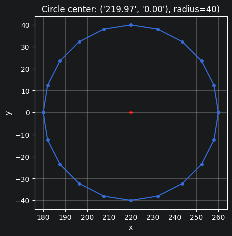
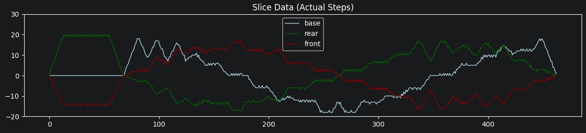

# Dobot v1 Control

Control a Dobot v1 arm (2016 model) with Python, based on the work (and alternate firmware) of
[maxosprojects](https://github.com/maxosprojects/open-dobot).

This is a further development of the [DobotSDK package](https://github.com/maxosprojects/open-dobot/tree/master/application/python/dobot), adding:

## Motion planning

The arm should move through a series of points with the highest possible speed allowed by the given maximum velocity and acceleration, full stops on direction changes only. For a circular path like the one below, it should try to maintain a continuous motion.



This is what the actual motion looks like now, with the actual speed of each joint over time (steps taken per interval of 50 ms):



## Free Accelerometer Conversion

 As it seems, the dobot arm was shipped with different accelerometer ICs at different production batches. The previously hardcoded conversion factors were not accurate for the SCA1000 accelerometers found in some Dobot v1 arms. Additionally, the sensor offsets need to be determined for each accelerometer anyway.

To move the arm tool as precisely as its mechanical capabilities allow along a straight line parallel to a flat surface, such as a table, calibrate the accelerometer offsets and conversion factor.

## Accelerometer Calibration

The `calibrate-accelerometers.py` tool helps in finding offsets and conversion factors for the installed accelerometers.

### Usage

```bash
python3 calibrate-accelerometers.py [mode] [options]
```

### Modes

- `continuous` (default): Continuously reports accelerometer data and calculated angles.
- `positions`: Calculates sensor offsets and conversion factors based on two measured positions.

### Options

- `--pos1 X Y Z`: First position for calibration (default: `120 0 0`).
- `--pos2 X Y Z`: Second position for calibration (default: `320 0 0`).
- `--offset H V`: End effector offset: horizontal and vertical distance of the mounted tool from joint 3 (default: `51 15`).

## Testing

This project uses `pytest` for testing. To run the tests, install the dependencies and run:

```bash
pytest
```
